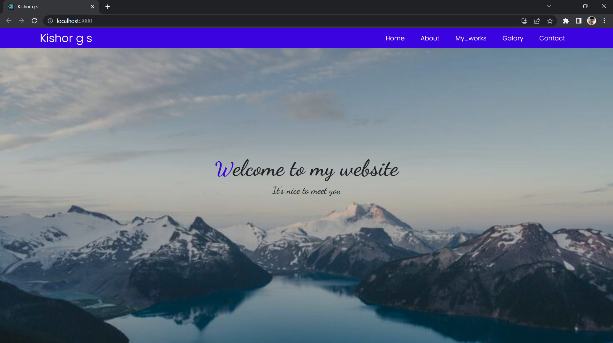
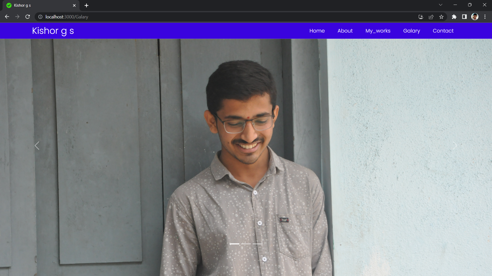
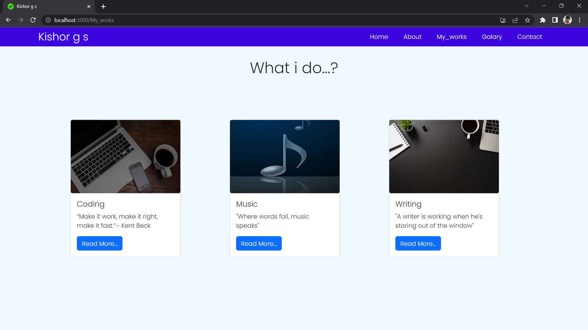
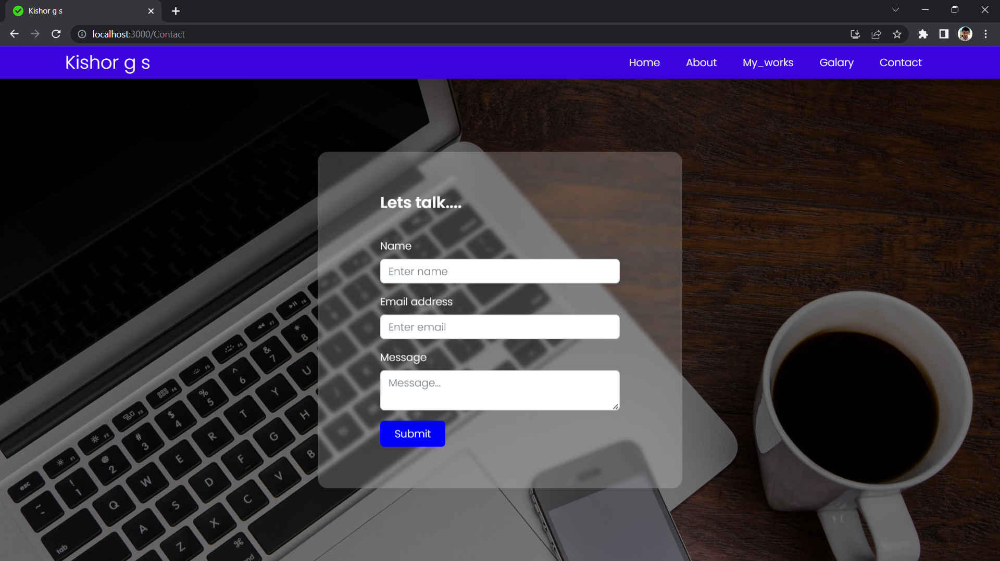
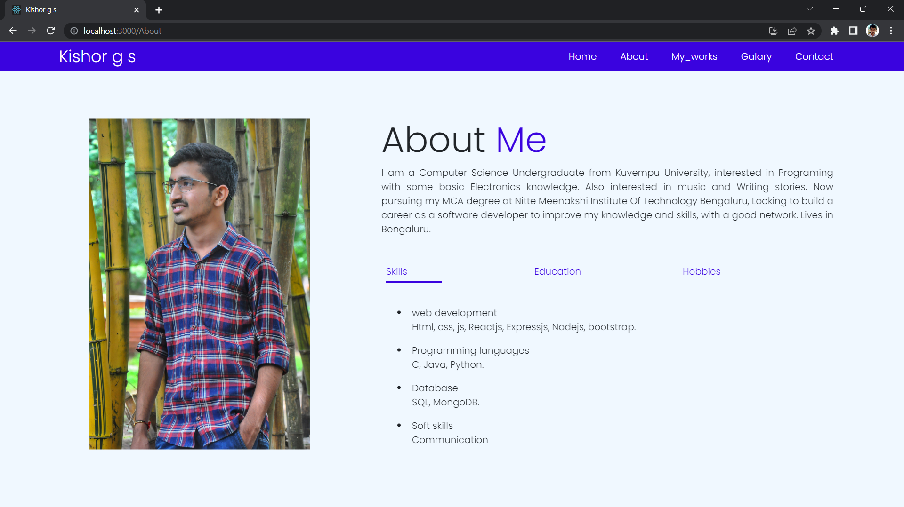

# Portfolio Website (Frontend)

Welcome to my portfolio website! 🎉 This project showcases my skills as a developer, featuring projects I've worked on and the technologies I am proficient in.

## Live Demo 🌐

Check out the live version of my portfolio website here: [https://kishor-g-s.netlify.app/](https://kishor-g-s.netlify.app/)

## Features

- Responsive design for various screen sizes
- Showcases projects with descriptions and links
- User-friendly navigation

## Technologies Used

- ReactJS
- NodeJS
- MongoDB
- ExpressJS

## Screenshots 📸

### Home Section

*The home section introduces visitors to my portfolio with a welcoming message and highlights of my skills.*

### Gallery Section

*The gallery section displays images from various projects I've worked on, showcasing my design and development capabilities.*

### Work Section

*In the work section, I detail the projects I've completed, including descriptions and links for further exploration.*

### Contact Section

*The contact section provides a way for visitors to get in touch with me, featuring a simple form for inquiries.*

### About Section

*The about section shares my background, skills, and journey as a developer, giving visitors insight into my professional experience.*

## Setup Instructions 🛠️

1. **Clone the repository**

   ```bash
   git clone https://github.com/YOUR_GITHUB_USERNAME/YOUR_FRONTEND_REPO_NAME.git
   ```

2. **Navigate to the project directory**

   ```bash
   cd YOUR_FRONTEND_REPO_NAME
   ```

3. **Install dependencies**

   ```bash
   npm install
   ```

4. **Start the development server**

   ```bash
   npm start
   ```

5. **Open your browser**
   Visit `http://localhost:3000` to view the website!

## Contributing 🤝

Contributions are welcome! Feel free to open issues or submit pull requests.

